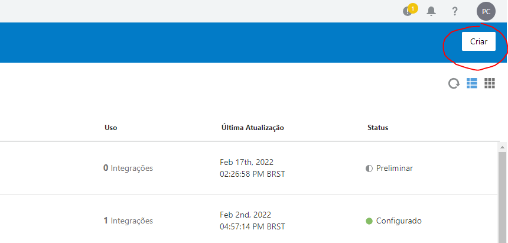
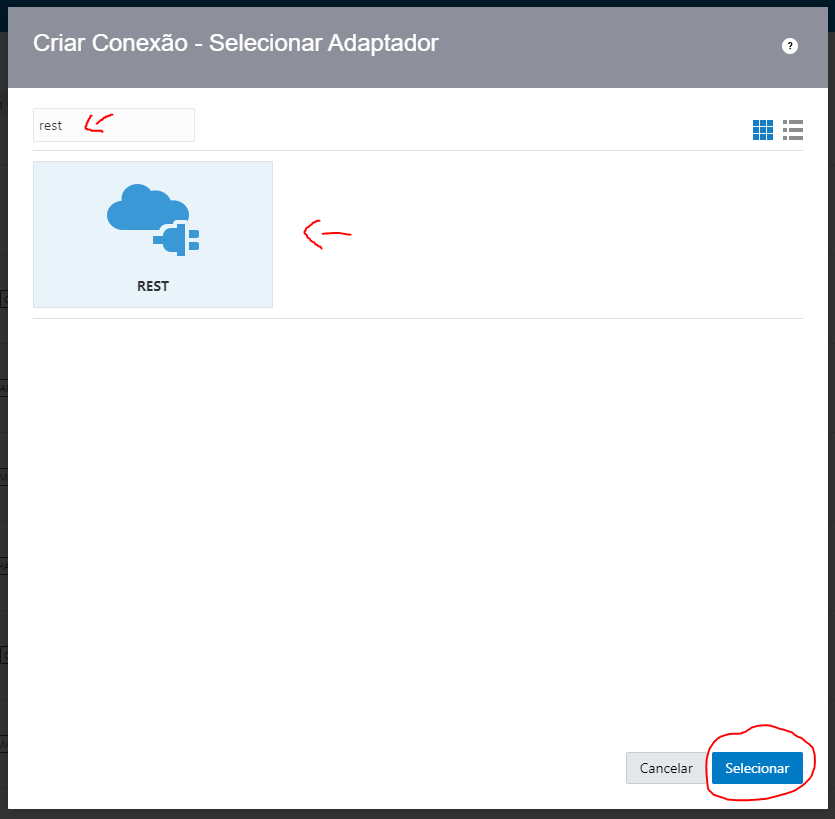

# Lab 01 - Workshop OIC

Criando uma integracão simples utilizando adaptadores REST.

## Description

Neste laboratório vamos montar uma integracão para chamar uma API do IBGE e retornar seu resultado.

## Vamos nessa !

### 1. Provisionar nosso ambiente OIC

* Abra sua console do OCI


* No menu lateral esquerdo, selecione a opcão de integration


* Selecione o compartment de sua escolha e siga os passos abaixo para criar um novo ambiente


* Após provisionado, abra o ambiente e clique em "Service Console" para acessar seu OIC


### 2. Configurar adaptadores para a integracão

* Depois de aberto seu OIC, clique na aba "integracões" e logo após em "conexões"


* Selecione a opcão "Criar" que esta na direita da tela


* Pesquise por "Rest" e selecione o adaptador


* Configure o adaptador da seguinte maneira:
``` 
Tipo de conexão: "URL Base da API Rest"
URL de Conexão: https://servicodados.ibge.gov.br/api/v1/localidades
Auth: "No security Policy"
```


* Teste e Salve seu conector, após isso pode fechar essa tela


### 3. Criar nossa primeira integracão

* Selecione a aba "Integracões" acima da aba de "Conexões"


* Clique em "Criar" e selecione a opcão "Orquestrada por App"


* Preencha os campos necessário e clique em "Criar"


* Como primeiro conector vamos utilizar o "Sample Rest Endpoint", pode ser encontrado pesquisando ou então no menu lateral direito, indo em Rest Adapters e o encontrando na lista que aparecer.


* Configure o conector "acionador" da nossa integracão


* Adicione o seguinte template JSON como Resposta:
```
[ {
  "id" : 520005005,
  "nome" : "Abadia de Goiás",
  "municipio" : {
    "id" : 5200050,
    "nome" : "Abadia de Goiás",
    "microrregiao" : {
      "id" : 52010,
      "nome" : "Goiânia",
      "mesorregiao" : {
        "id" : 5203,
        "nome" : "Centro Goiano",
        "UF" : {
          "id" : 52,
          "sigla" : "GO",
          "nome" : "Goiás",
          "regiao" : {
            "id" : 5,
            "sigla" : "CO",
            "nome" : "Centro-Oeste"
          }
        }
      }
    }
  }
} ]
```


* Arraste agora o conector que criamos no primeiro passo, no qual configuramos com a API do IBGE


* Configure o conector com a "api ibge" da nossa integracão

* Adicione o seguinte template JSON como Resposta:
```
{
  "id" : 0,
  "nome" : "distrito"
}
```


* Exclua um dos componentes de mapeamento para não ficar duplicado


* Adicione um componente de mapeamento agora após o ultimo conector Rest que colocamos


* Aqui é onde vamos fazer o de/para das informacões recebidas da API do IBGE para resultado final da integracão (Arraste os campos da esquerda pra direita igual a imagem abaixo) e clique em "Validar" antes de fechar.


* Agora selecione o menu sanduiche na direita da tela, e clique em "Rastreamento"


* Arraste o campo "Nome" para a primeira coluna disponível e clique em "Salvar"


* Podemos agora salvar nossa integracão e fechar logo em seguida


### 4. Testar nossa primeira integracão

* Passe o mouse em cima da sua integracão e clique no botão de "Power", após isso clique me "Ativar"


* Passe o mouse em cima da sua integracão novamente e clique no botão de "Play", após isso selecione "Teste"


* Agora para fazer o teste final, clique novamente em "TESTE" e aguardamos para receber o retorno da API !


## Autor

Pedro Carrijo
LinkedIn: [@pedrocarrijo](https://twitter.com/dompizzie)

## Documentacões adicionais

* [OIC-GETTING-STARTED](https://docs.oracle.com/en/cloud/paas/integration-cloud/index.html)
* [OIC-REST-ADAPTER](https://docs.oracle.com/en/cloud/paas/integration-cloud/rest-adapter/index.html)
